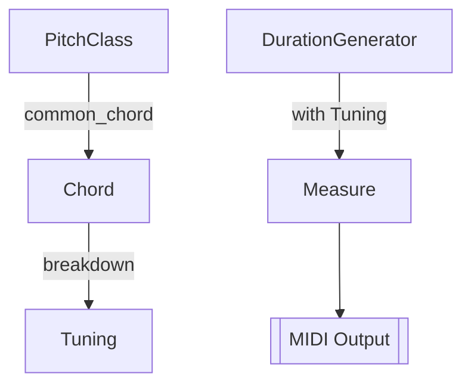

# Simple Compose - Algorithmic Music Generation Toolkit in Rust

[](README.md)
[](README.zh-CN.md)


A Rust-powered intelligent music generation system that creates MIDI compositions through algorithmic composition. This project integrates core features including chord progression generation, rhythm pattern synthesis, and MIDI output, providing an efficient framework for music creation and computational composition.

## ✨ Key Features

- **Smart Chord Generation**: Automatic chord progression synthesis (I-IV-V-I patterns)
- **Rhythm Engine**: Customizable rhythmic patterns (3/4, 4/4 time signatures)
- **Dual-track Composition**: Parallel melody and accompaniment generation
- **MIDI Real-time Playback**: Integrated MIDI device interface
- **Extensible Architecture**: Modular design for custom progressions and rhythms
- **High Performance**: Rust-native implementation with zero runtime overhead

## 🚀 Quick Start

### Requirements

- Rust 1.68+ toolchain
- System MIDI playback capabilities

### Installation

```bash
# Clone repository
git clone https://github.com/W-Mai/simple_compose.git
cd simple_compose

# Build & run
cargo run --release
```

## 🎼 Architecture Overview

### Core Components



### Project Structure

```
simple_compose/
├── src/
│   └── main.rs  # Core implementation
└── Cargo.toml   # Dependency management
```

## 🎹 Usage Guide

### Basic Configuration

```rust
// Configure pitch class sequence (C Major → F Major → ...)
let pitch_classes = [
    PitchClass::C,
    PitchClass::F,
    PitchClass::D,
    PitchClass::G,
    PitchClass::C,
];

// Initialize score with dual-track configuration
let mut score = Score::<2>::new()
    .with_tempo(Tempo::Vivace)    // Vivace tempo (~176 BPM)
    .with_time_signature(3, DurationBase::Quarter); // 3/4 time
```

### Chord Progression Rules

Define progressions using macro:

```rust
degrees!(pitch_class => 1 1 4 5 1 4 1)
```
Equivalent to: I-I-IV-V-I-IV-I progression

### Rhythm Customization

```rust
// Generate rhythmic patterns using duration_utils
m[1] = duration_utils::generate_one_measure(
    &dg,                // Duration generator
    chords[i].clone(),  // Current chord
    BEAT                // Beats per measure
);
```

## ⚙️ Advanced Configuration

### Pitch Class Extensions

Support for all 12-tone equal temperament:

```rust
PitchClass::CSharp
PitchClass::DFlat
PitchClass::D
// ...other classes
```

### Tempo Configuration

Preset tempo options:

```rust
Tempo::Largo      // Largo (40-60 BPM)
Tempo::Andante    // Andante (76-108 BPM)
Tempo::Allegro    // Allegro (120-168 BPM)
Tempo::Presto     // Presto (168-200 BPM)
```

Custom BPM:

```rust
.with_tempo(128)
```

### Time Signature Options

Common time signatures:

```rust
// 4/4 time
.with_time_signature(4, DurationBase::Quarter)

// 6/8 time
.with_time_signature(6, DurationBase::Eighth)
```

## 🎵 Sample Output

Generated MIDI structure:

```
Track 1 (Chord Progression):
C Major (quarter) → F Major → D Minor → G Major...

Track 2 (Arpeggio):
C4-E4-G4 (dotted) → F4-A4-C5 ...
```

## 🤝 Contribution

We welcome contributions through:

1. Issue reporting
2. Pull requests
3. Chord algorithm extensions
4. New rhythm engines
5. MIDI format enhancements

## 📜 License

MIT Licensed. See [LICENSE](LICENSE) for details.
