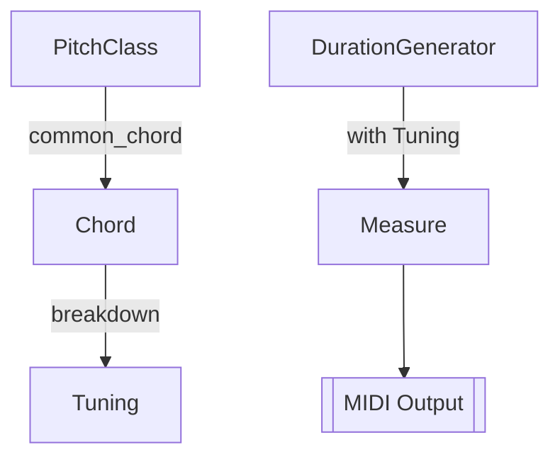

# Simple Compose - 基于Rust的智能音乐生程序

[](README.md)
[](README.zh-CN.md)


一个基于Rust语言开发的智能音乐生成程序，通过算法化作曲技术自动生成MIDI音乐。本项目整合了和弦生成、节奏模式、MIDI输出等核心功能，为音乐创作和算法作曲提供简洁高效的开发框架。

## ✨ 核心特性

- **智能和弦生成**：支持多调式自动和弦生成（I-IV-V-I等常见进行）
- **节奏模式引擎**：内置可定制的节奏生成算法（支持3/4、4/4等拍号）
- **双轨编曲**：主旋律+伴奏的双轨同步生成架构
- **MIDI实时输出**：集成MIDI设备接口，支持实时播放和~~导出~~
- **可扩展架构**：模块化设计，支持自定义和弦进行和节奏模式
- **高性能运行时**：基于Rust语言实现，内存安全且零运行时开销

## 🚀 快速开始

### 环境要求

- Rust 1.68+ 环境
- 系统MIDI播放设备

### 安装步骤

```bash
# 克隆仓库
git clone https://github.com/W-Mai/simple_compose.git
cd simple_compose

# 编译并运行
cargo run --release
```

## 🎼 架构解析

### 核心模块



### 代码结构

```
simple_compose/
├── src/
│   └── main.rs  # 主逻辑入口
└── Cargo.toml           # 依赖配置
```

## 🎹 使用指南

### 基础配置

```rust
// 配置调式序列 (C大调 → F大调 → ...)
let pitch_classes = [
    PitchClass::C,
    PitchClass::F,
    PitchClass::D,
    PitchClass::G,
    PitchClass::C,
];

// 初始化乐谱（双轨配置）
let mut score = Score::<2>::new()
    .with_tempo(Tempo::Vivace)    // 速度：Vivace（约176 BPM）
    .with_time_signature(3, DurationBase::Quarter); // 3/4拍
```

### 和弦生成规则

通过宏定义和弦进行模式：

```rust
degrees!(pitch_class => 1 1 4 5 1 4 1)
```

等价于：`I-I-IV-V-I-IV-I` 和弦进行

### 节奏模式定制

```rust
// 使用duration_utils生成节奏模式
m[1] = duration_utils::generate_one_measure(
    &dg,                // 时值生成器
    chords[i].clone(),  // 当前和弦
    BEAT                // 每小节拍数
);
```

## ⚙️ 高级配置

### 调式扩展

支持所有12平均律调式：

```rust
PitchClass::CSharp
PitchClass::DFlat
PitchClass::D
// ...其他调式
```

### 速度配置

内置多种速度预设：

```rust
Tempo::Largo      // 广板 (40-60 BPM)
Tempo::Andante    // 行板 (76-108 BPM)
Tempo::Allegro    // 快板 (120-168 BPM)
Tempo::Presto     // 急板 (168-200 BPM)
```

或自定义精确BPM：

```rust
.with_tempo(128)
```

### 拍号配置

支持常见拍号组合：

```rust
// 4/4拍
.with_time_signature(4, DurationBase::Quarter)

// 6/8拍
.with_time_signature(6, DurationBase::Eighth)
```

## 🎵 示例输出

运行后将生成以下MIDI结构：

```
Track 1 (和弦进行):
C Major (四分音符) → F Major → D Minor → G Major...

Track 2 (分解和弦):
C4-E4-G4 (附点节奏) → F4-A4-C5 ...
```

## 🤝 参与贡献

欢迎通过以下方式参与项目：

1. 提交Issue报告问题
2. Fork仓库并提交Pull Request
3. 扩展和弦生成算法
4. 开发新的节奏模式引擎
5. 增加更多MIDI输出格式支持

## 📜 许可证

本项目采用 MIT 许可证，详见 [LICENSE](LICENSE) 文件。
